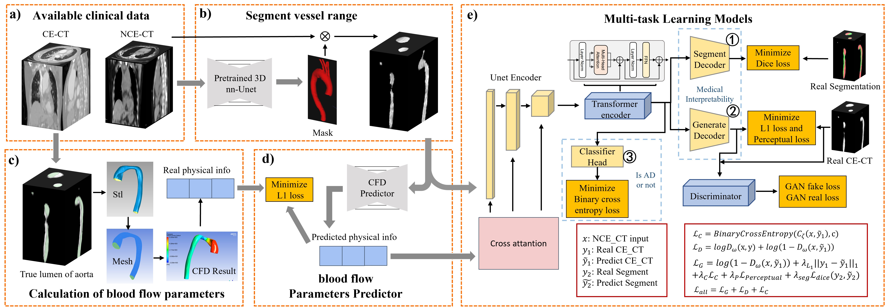

# PIAD
This is the official implementation of our MICCAI 2024 paper Physical-priors-guided Aortic Dissection Detection using Non-Contrast-Enhanced CT images.


## Abstract
Aortic dissection (AD) is a severe cardiovascular emergency that requires prompt and precise diagnosis to improve chances of survival. Given the limited use of Contrast-Enhanced Computed Tomography (CE-CT) in routine clinical screenings, this study presents a new deep learning model that enhances the diagnostic process using non-contrast-enhanced CT (NCE-CT) images. In detail, we integrate biomechanical and hemodynamic physical priors into a 3D U-Net model and utilize a transformer encoder to extract superior global features, along with a cGAN-inspired discriminator for the generation of realistic CE-CT-like images. The proposed model not only innovates AD detection on NCE-CT but also provides a safer alternative for patients contraindicated for contrast agents. Comparative evaluations and ablation studies against existing deep learning algorithms demonstrate the superiority of our model in terms of recall, AUC, and F1 score metrics standing at 0.882, 0.855, and 0.829, respectively. By incorporating physical priors into the diagnostic process, we achieve a significant advancement that offers a nuanced and non-invasive alternative, seamlessly integrating medical imaging with the dynamic physical aspects of human physiology.
## Environment Set Up
Install required packages:
```bash
conda create -n PIAD python=3.8
conda activate PIAD
pip install -r requirements.txt
```
## Citation
If you find our paper/code useful, please consider citing our work: